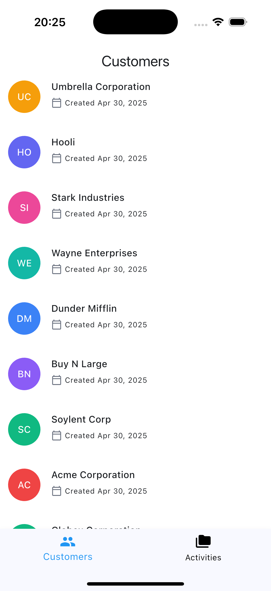
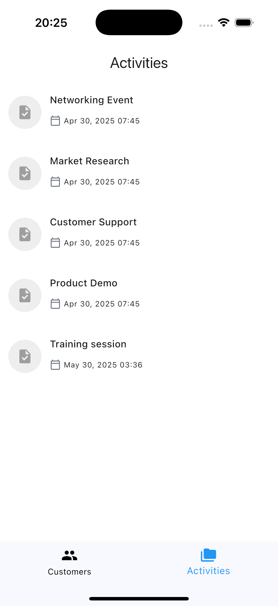
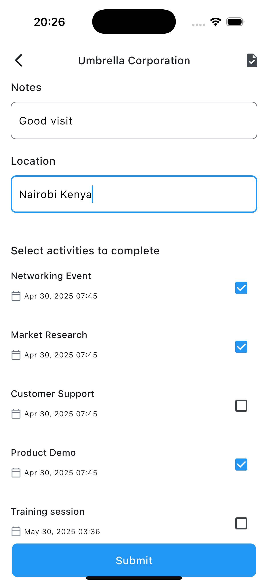
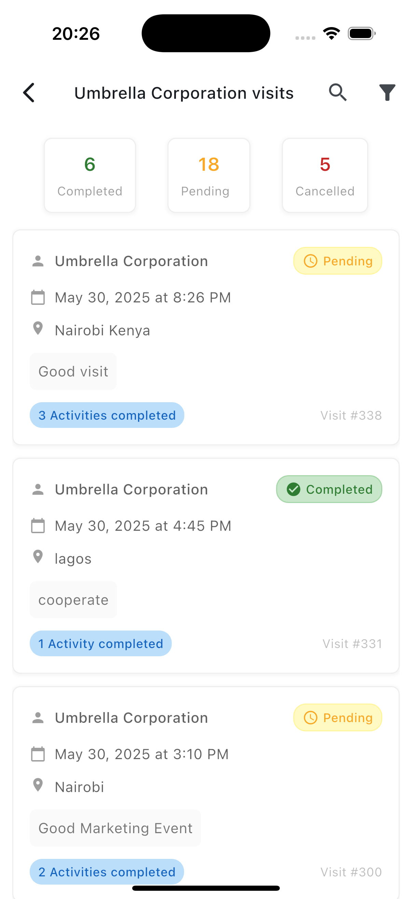
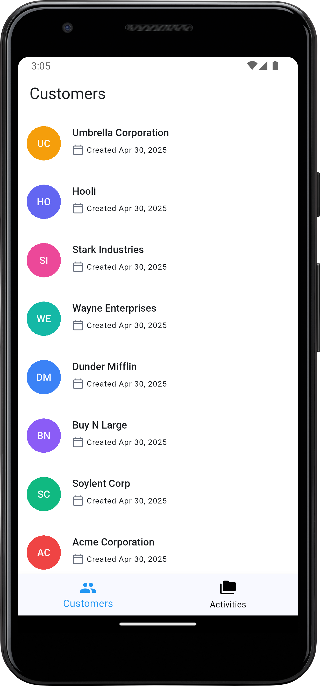
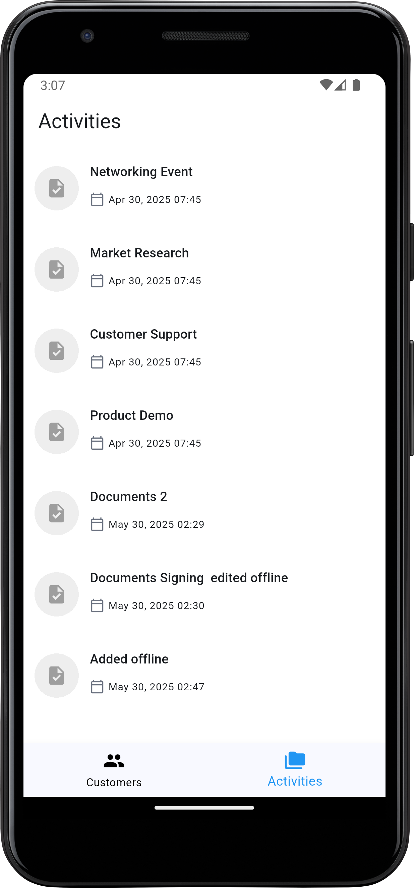
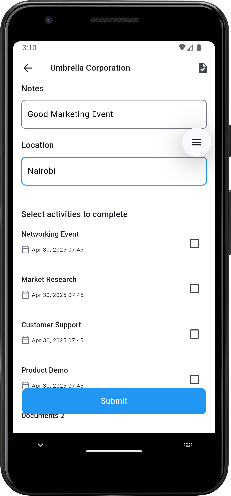
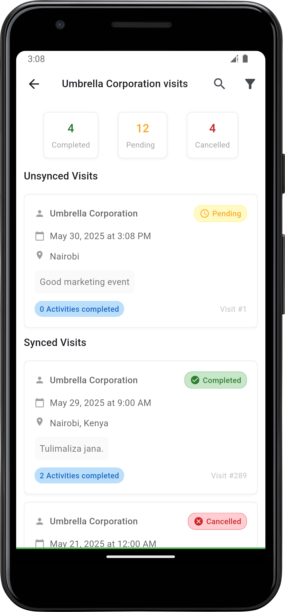
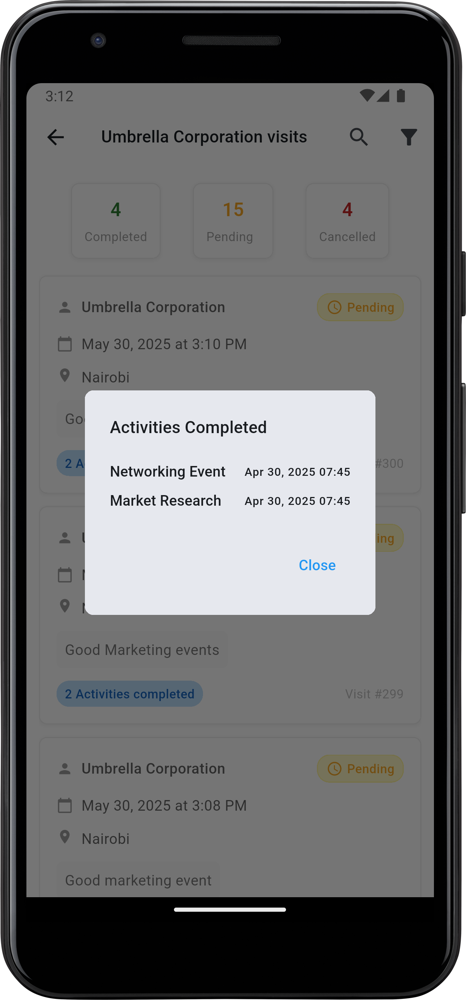

# Route-to-Market (RTM) Sales Force Automation App

A Flutter-based mobile application designed to streamline the sales force automation process for
Route-to-Market operations. The app enables sales teams to effectively manage their customer visits,
track orders, and enhance on-the-ground decision-making.

## Features

- 🔍 Customer and visit management with search & filters
- 📅 Track customer visits and order statuses
- ⬆️ Offline-first data with persistent storage via Hive and Hydrated BLoC
- 🌐 Network status awareness using `connectivity_plus`
- 📈 Reactive UI with Flutter BLoC state management
- 🧪 Comprehensive testing support with `bloc_test` and `mocktail`

## Screenshots


### iOS

<p align="center">
 
 
 
 

</p>


### Android

<p align="center">
 
 
 
 
 
</p>


---

## Architectural Choices

| Package                | Description                                 |
|------------------------|---------------------------------------------|
| `flutter_bloc`         | Business logic component for state handling |
| `hydrated_bloc`        | Automatically persists BLoC state           |
| `dio`                  | Powerful HTTP client                        |
| `hive_flutter`         | Lightweight key-value database              |
| `json_serializable`    | Code generation for JSON models             |
| `cached_network_image` | Efficient image caching                     |
| `connectivity_plus`    | Network status monitoring                   |
| `intl`                 | Date and number formatting                  |

- I implemented the app with hydrated bloc and bloc to ensure the app caches the data from the api
  easily and resumes the last state and data since the app was closed.

- I added Hive for storing the visits offline before they are synced. once synced I clear my
  database and rely on the data received from the server as a single source of truth.

- I used dio over http package due to it's ease of use syntax wise and less boilerplate code.

- I used abstract classes for remote and local data sources to enable easy swapping of
  implementations

---

## Offline Support, Testing and CI

- I use Hive for storing the visits offline before they are synced. once synced I clear my
  database and rely on the data received from the server as a single source of truth. Syncing can
  also be triggered automatically by changes in the device internet connectivity (Once the device
  comes back offline)
- You can run tests using

```bash
  flutter run
```

- I use Github actions for CI/CD. Every time a push is made to the main branch we run tests and
  build an apk

## Assumptions, trade-offs, or limitations

- We assume that each visit is unique and will not be overwritten in the database (Since including
  other keys on the visit dto throws an error when syncing the visit).

- The server does not return any body after syncing the data hence I have to re-fetch the data once
  I sync the visits in order to get the fresh visits with their id's.

- I assume that the server will return all activities (or at least filter out missing activities)
  that other visits have completed. Some are missing, for good user experience I'm filtering out the
  missing visit activities on the visit page.

## Getting Started

To get a local copy up and running, follow these simple steps.

### 🔧 Prerequisites

- Flutter SDK >= 3.7.2
- Dart >= 3.x
- Android Studio / VS Code
- Emulator or real device

### Installation

1. **Clone the repo**

```bash
git clone https://github.com/yourusername/route_to_market.git
cd route_to_market
````

2. **Install dependencies**

```bash
flutter pub get
```

3. **Run code generation (for JSON models, etc.)**

```bash
make gen
```

4. **Add api key to the project**

Add a file .env in the root folder and add your api key in the following format

`API_KEY=your_api_key`

5**Run the app**

```bash
flutter run
```

---

## Project Structure

```bash
lib/
├── data/               # Manages the data layer from local database and remote repository
    ├── remote          #Data from the internet
    ├── local           #Data from database
├── domain/             # JSON models with annotations
    ├── dto             #Data serialization to and from the internet
    ├── models          #Data Models such as Activities, visits and customers
├── presentation/       # UI screens and widgets           
├── utils/              # Helper methods and constants
└── main.dart           # Entry point
```

---

## Running Tests

```bash
flutter test
```

---

## Author

* Charles Muchogo

